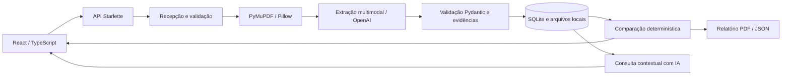

# Arquitetura do InsurMinds

O InsurMinds é um MVP local para leitura e comparação documental de apólices D&O. A interface apresenta 16 critérios, o conteúdo extraído e as evidências. O usuário valida a interpretação. A solução não produz ranking de seguradoras ou recomendação de contratação.

## Componentes e fluxo

O frontend usa React 19, TypeScript, Vite e Lucide. Fontes DM Sans e Manrope são distribuídas localmente. A interface permite navegação por teclado, modais nativos, estados de erro, busca, filtros, seleção limitada e adaptação a dispositivos móveis.

A API usa Starlette, uvicorn, Pydantic, SQLite e HTTPX. O servidor tem um único processo e até duas tarefas simultâneas de extração. A fila em memória aceita até seis tarefas pendentes ou ativas. Reinícios marcam trabalhos incompletos como falha, permitindo nova tentativa. Não há fila distribuída nem promessa de alta disponibilidade.

## Componentes especializados

O termo agente designa responsabilidades do pipeline, não uma equipe de agentes autônomos com ferramentas abertas. A extração e a consulta usam IA generativa; a recepção, a validação, a comparação e o relatório são determinísticos.

1. Recepção (`backend/app.py`): recebe o arquivo, valida conteúdo, limita tamanho e atribui identificador UUID. Nomes enviados pelo usuário não determinam caminhos de armazenamento.
2. Leitura (`backend/documents.py`): extrai texto por página. Páginas com menos de 80 caracteres são rasterizadas. Imagens PNG, JPEG e WebP são normalizadas para leitura visual.
3. Extração (`backend/agents.py`): envia texto e imagens, numerados por página, para a Responses API. Solicita JSON Schema estrito e desabilita armazenamento da resposta com `store: false`.
4. Estruturação e validação (`backend/models.py`, `backend/agents.py`): valida tipos, classificação D&O, chaves únicas, páginas e presença literal das citações no texto.
5. Comparação (`backend/agents.py`): compara os mesmos 16 campos entre dois a quatro documentos. O resultado distingue diferença textual, igualdade textual e dado ausente.
6. Relatório (`backend/reports.py`): gera PDF com tabela comparativa, limitações e trechos de origem. JSON preserva o resultado estruturado.
7. Consulta (`backend/app.py`): pergunta e resposta com IA sobre fatos já extraídos. O prompt exige páginas e admite ausência de informação. As citações da resposta livre não têm validador automático.

## Contrato de dados

Cada apólice contém ID, nome, arquivo, status, datas UTC, modelo, indicador de demonstração, páginas, fatos e avisos. Cada fato contém `key`, `value`, `quote`, `page` e `evidence_status`.

Os estados das evidências são `verified` (trecho localizado por comparação normalizada de espaços e caixa), `visual_review` (leitura multimodal que exige conferência visual) e `missing`. O estado `verified` comprova apenas presença textual, não a correção jurídica ou lógica do valor extraído.

Dados sem trecho ou sem página válida são descartados. Se a página contém texto e o trecho não aparece, o valor é descartado. Em páginas rasterizadas, uma citação não encontrada no texto permanece marcada para revisão visual. A ausência de informação nunca se converte em exclusão ou cobertura contratada.

SQLite mantém duas tabelas, `policies` e `comparisons`, com identificadores e documentos JSON. As comparações guardam uma fotografia dos fatos usados, preservando o resultado histórico. O modo WAL facilita leituras concorrentes. As conexões são fechadas explicitamente.

## Decisões arquiteturais

SQLite elimina a instalação de um banco separado e é suficiente para o workspace local. JSON preserva o contrato aninhado sem migrações prematuras; consultas analíticas em escala exigiriam tabelas normalizadas.

A leitura híbrida reduz o envio de imagens em PDFs pesquisáveis. A heurística de 80 caracteres pode falhar em páginas com texto decorativo ou OCR ruim. O limite de 20 páginas visuais e 220 mil caracteres evita truncamento silencioso e reduz custos inesperados.

Uma única chamada estruturada por documento mantém o pipeline didático. O modelo padrão é `gpt-4.1-mini`, configurável por `OPENAI_MODEL`. A disponibilidade depende da conta. A comparação determinística mantém diferenças reproduzíveis e evita que uma segunda geração invente um ranking.

A chamada utiliza timeout de 180 segundos e não faz repetição automática que possa duplicar custos. O usuário pode reprocessar um documento com falha. Não há garantia de idempotência no provedor.

## Limites e proteção de dados

O MVP aceita até 20 MB, 60 páginas PDF, 20 páginas visuais e 220 mil caracteres por documento. PDF criptografado e formatos não reconhecidos são rejeitados. Um documento deve representar uma única apólice e suas condições coerentes.

A chave fica no `.env` do servidor e não é enviada ao navegador. Documentos são dados não confiáveis para o prompt. Não são disponibilizadas ferramentas de execução ao modelo. O servidor não inclui autenticação e deve operar em loopback, em um único processo. Publicação na Internet requer autenticação, isolamento por usuário, quotas, proxy com limite de requisição, políticas de retenção e revisão de segurança.

`store: false` não equivale a garantia de retenção zero. O conteúdo é enviado ao provedor de IA conforme a política da conta. Arquivos originais, textos e rasterizações ficam em `data/`; essa pasta não entra no repositório ou no ZIP. O MVP não implementa criptografia em repouso nem exclusão pela interface.

Condições gerais podem descrever coberturas não contratadas. Exclusões espalhadas por páginas podem não caber em uma única evidência por campo. Valores equivalentes com redações diferentes aparecem como diferenças textuais. Não há normalização atuarial, jurídica ou cambial.

## Validação e evolução

Testes automatizados cobrem leitura de PDF e imagem, PDFs criptografados, limites, dados ausentes, evidências falsas, persistência, comparação e exportação. O teste de upload com provedor simulado verifica a integração interna, mas não comprova precisão em contratos reais. Uma chamada real com a chave da equipe é condição pendente de validação.

Próximos passos: corpus público licenciado com anotações de especialistas, métricas por campo, avaliação de OCR, evidências múltiplas, divisão semântica de documentos longos, revisão editável e versionada, fila durável, autenticação e comparação semântica apoiada nas evidências.

## Fontes

- Enunciado do Projeto Final I2A2, fornecido pelo usuário, datado de 15/07/2026. Prazo informado: 06/10/2026 às 23h59.
- OpenAI, Structured Outputs: https://developers.openai.com/api/docs/guides/structured-outputs
- OpenAI, File inputs: https://developers.openai.com/api/docs/guides/file-inputs
- Documentos de demonstração: criação sintética autoral do projeto em `backend/demo.py`. Aurora, Vértice e Horizonte são nomes fictícios, sem relação com contratos reais.
- O endereço do Sebrae informado no enunciado não pôde ser acessado na preparação. O pitch segue o problema, solução, funcionamento, arquitetura, resultados de demonstração e próximos passos.
- Repositório público: https://github.com/vicTmm/i2a2-desafio-final.
