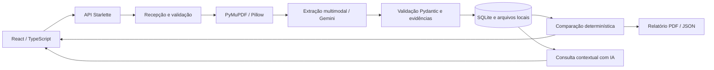

# Arquitetura do InsurMinds

O InsurMinds é um MVP local para leitura e comparação documental de apólices D&O. A interface apresenta 16 critérios, o conteúdo extraído e as evidências. O usuário valida a interpretação. A solução não produz ranking de seguradoras ou recomendação de contratação.

## Componentes e fluxo

```mermaid
flowchart LR
  U[React / TypeScript] --> A[API Starlette]
  A --> R[Recepção e validação]
  R --> T[PyMuPDF / Pillow]
  T --> E[Extração multimodal / Gemini]
  E --> V[Validação Pydantic e evidências]
  V --> D[(SQLite e arquivos locais)]
  D --> C[Comparação determinística]
  C --> U
  C --> P[Relatório PDF / JSON]
  D --> Q[Consulta contextual com IA]
  Q --> U
```

O frontend usa React 19, TypeScript, Vite, Tailwind CSS 4, shadcn/ui com Radix e Lucide. A fonte DM Sans é distribuída localmente. A interface permite navegação por teclado, diálogos com controle e retorno de foco, estados de erro, busca, filtros, seleção limitada e adaptação a dispositivos móveis. Tokens e padrões visuais estão em `DESIGN.md` e os componentes reutilizáveis em `src/components/ui/`.

A API usa Starlette, uvicorn, Pydantic, SQLite e HTTPX. O servidor tem um único processo e até duas tarefas simultâneas de extração. A fila em memória aceita até seis tarefas pendentes ou ativas. Reinícios marcam trabalhos incompletos como falha, permitindo nova tentativa. Não há fila distribuída nem promessa de alta disponibilidade.

## Componentes especializados

O termo agente designa responsabilidades do pipeline, não uma equipe de agentes autônomos com ferramentas abertas. A extração e a consulta usam IA generativa; a recepção, a validação, a comparação e o relatório são determinísticos.

1. Recepção (`backend/app.py`): recebe o arquivo, valida conteúdo, limita tamanho e atribui identificador UUID. Nomes enviados pelo usuário não determinam caminhos de armazenamento.
2. Leitura (`backend/documents.py`): extrai texto por página. Páginas com menos de 80 caracteres são rasterizadas. Imagens PNG, JPEG e WebP são normalizadas para leitura visual.
3. Extração (`backend/agents.py`): divide o documento em blocos com páginas originais, envia texto e imagens ao Google GenAI e solicita JSON estruturado. `backend/checkpoints.py` salva respostas concluídas para retomada local. A consolidação determinística preserva valores distintos e suas evidências, sem decidir qual condição prevalece.
4. Estruturação e validação (`backend/models.py`, `backend/agents.py`): valida tipos, classificação D&O, chaves únicas, páginas e presença literal das citações no texto.
5. Comparação (`backend/agents.py`): compara os mesmos 16 campos entre dois a quatro documentos. O resultado distingue diferença textual, igualdade textual e dado ausente.
6. Relatório (`backend/reports.py`): gera PDF com tabela comparativa, limitações e trechos de origem. JSON preserva o resultado estruturado.
7. Consulta (`backend/app.py`): usa `GenerateContent` para responder perguntas sobre fatos já extraídos. O prompt solicita páginas e admite ausência de informação. As citações da resposta livre não têm validador automático.

## Contrato de dados

Cada apólice contém ID, nome, arquivo, status, datas UTC, modelo configurado, modelos efetivamente usados, progresso por bloco, indicador de demonstração, páginas, fatos e avisos. Cada fato contém `key`, `value`, `quote`, `page`, `evidence_status`, uma lista `evidence`, versões com suas próprias evidências em `variants` e `needs_review`. `quote/page` preservam a primeira referência para compatibilidade com documentos antigos.

Os estados das evidências são `verified` (trecho localizado por comparação normalizada de espaços e caixa), `visual_review` (leitura multimodal que exige conferência visual) e `missing`. O estado `verified` comprova apenas presença textual, não a correção jurídica ou lógica do valor extraído.

Dados sem trecho ou sem página válida são descartados. Se a página contém texto e o trecho não aparece, o valor é descartado. Em páginas rasterizadas, uma citação não encontrada no texto permanece marcada para revisão visual. A ausência de informação nunca se converte em exclusão ou cobertura contratada.

SQLite mantém duas tabelas, `policies` e `comparisons`, com identificadores e documentos JSON. As comparações guardam uma fotografia dos fatos usados, preservando o resultado histórico. O modo WAL facilita leituras concorrentes. As conexões são fechadas explicitamente.

## Decisões arquiteturais

SQLite elimina a instalação de um banco separado e é suficiente para o workspace local. JSON preserva o contrato aninhado sem migrações prematuras; consultas analíticas em escala exigiriam tabelas normalizadas.

A leitura híbrida reduz o envio de imagens em PDFs pesquisáveis. A heurística de 80 caracteres pode falhar em páginas com texto decorativo ou OCR ruim. Cada bloco contém no máximo 60 mil caracteres, 20 páginas e 4 imagens. Páginas com texto acima do limite são divididas com sobreposição de 500 caracteres, mantendo o número original; nenhum trecho é cortado silenciosamente.

Uma chamada estruturada por bloco permite analisar documentos longos. O modelo padrão é `gemini-3.8-flash`, configurável por `GEMINI_MODEL`, com alternativa `gemini-3.7-flash` em `GEMINI_FALLBACK_MODELS`. Deixar a variável vazia desativa a alternância. A disponibilidade e a faixa gratuita dependem da conta. A comparação determinística ignora a numeração das páginas ao comparar valores, mantém diferenças reproduzíveis e evita que uma segunda geração invente um ranking.

As chamadas têm timeout de 90 segundos e até três tentativas por modelo, com espera exponencial e jitter para erros transitórios. As repetições internas do SDK são desativadas para evitar multiplicação de tentativas. Um fluxo serializado de chamadas respeita um intervalo mínimo de 15 segundos, configurável por `GEMINI_REQUEST_INTERVAL`. A alternância ocorre após indisponibilidade ou modelo não encontrado, nunca para contornar cotas ou erros de chave. Checkpoints gravados atomicamente usam hash do conteúdo do bloco, prompt, schema e modelos. Reprocessamentos e reinícios reutilizam os blocos concluídos; não há garantia de idempotência no provedor para chamadas interrompidas antes do checkpoint.

## Limites e proteção de dados

O MVP aceita até 20 MB, 300 páginas PDF e 2 milhões de caracteres por documento. Páginas visuais são limitadas por bloco, sem o limite antigo de 20 por documento. PDF criptografado e formatos não reconhecidos são rejeitados. Um documento deve representar uma única apólice e suas condições coerentes.

A chave fica no `.env` do servidor e não é enviada ao navegador. Documentos são dados não confiáveis para o prompt. Não são disponibilizadas ferramentas de execução ao modelo. O servidor não inclui autenticação e deve operar em loopback, em um único processo. Embora o repositório seja público, a aplicação não deve ser exposta na Internet sem autenticação, isolamento por usuário, quotas, limite de requisições, políticas de retenção e revisão de segurança.

O código não configura uma política de retenção zero no provedor. O tratamento do conteúdo enviado depende das condições e configurações da conta Gemini. Arquivos originais, textos e rasterizações ficam em `data/`; essa pasta não entra no repositório ou no ZIP. O MVP não implementa criptografia em repouso nem exclusão pela interface.

Condições gerais podem descrever coberturas não contratadas. Evidências múltiplas e versões por bloco preservam passagens espalhadas, mas não comprovam que o resumo é completo ou correto. Valores equivalentes com redações diferentes aparecem como diferenças textuais. Não há normalização atuarial, jurídica ou cambial; condições que dependem de passagens em outros blocos precisam de revisão.

## Validação e evolução

Testes automatizados cobrem leitura de PDF e imagem, PDFs criptografados, limites, dados ausentes, evidências falsas, persistência, comparação e exportação. O teste automatizado de upload usa um provedor simulado. A execução real de 05/10/2026 com Gemini 3.8 Flash concluiu os dois PDFs fictícios: 16 critérios com evidências textuais verificadas em cada documento, 10 diferenças entre 16 campos e nenhuma ausência. As exportações PDF e JSON passaram. O registro está em `Projeto_Final_Artefatos/Validacao_IA_Exemplos.json`. Foram aprovados 32 testes Python e um teste Node de upload, além do build e da verificação de interface em desktop e celular. As quatro apólices privadas passaram pelos limites; a renovação Tecnogeo concluiu seis blocos com 15 critérios verificados, um ausente e 14 sinalizados para revisão. As demais falharam por indisponibilidade ou cota. Métricas estão em `Validacao_Apolices_Reais.json`. Isso não comprova a precisão em apólices reais; essa avaliação requer um conjunto de documentos apropriado e revisão especializada.

Próximos passos: corpus público licenciado com anotações de especialistas, métricas por campo, avaliação de OCR, divisão semântica de documentos longos, revisão editável e versionada, fila durável, autenticação e comparação semântica apoiada nas evidências.

## Fontes

- Enunciado do Projeto Final I2A2, fornecido pelo usuário, datado de 15/07/2026. Prazo informado: 06/10/2026 às 23h59.
- Google Gemini API, structured output: https://ai.google.dev/gemini-api/docs/structured-output
- Google Gemini API, multimodal: https://ai.google.dev/gemini-api/docs/vision
- Documentos de demonstração: criação sintética autoral do projeto em `backend/demo.py`. Aurora, Vértice e Horizonte são nomes fictícios, sem relação com contratos reais.
- O endereço do Sebrae informado no enunciado não pôde ser acessado na preparação. O pitch segue o problema, solução, funcionamento, arquitetura, resultados de demonstração e próximos passos.
- Repositório público: https://github.com/vicTmm/i2a2-desafio-final.
